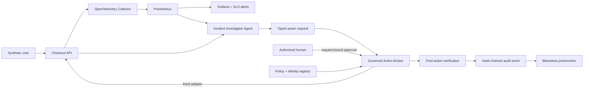
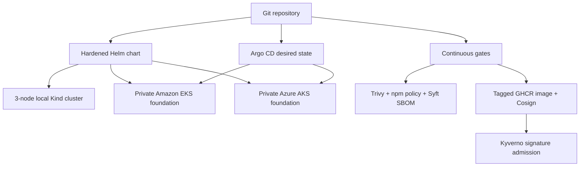

# SentinelSRE architecture

SentinelSRE is an evidence-first SRE engineering lab. It demonstrates how a
platform can observe a workload, evaluate reliability, investigate a failure,
propose a constrained action, require human authorization, verify recovery, and
retain reviewable evidence. The same repository defines hardened Kubernetes and
provider-native AWS/Azure foundations.

## System flow

## Deployment surfaces

## Implemented boundaries

| Surface | What is implemented | Proof |
| --- | --- | --- |
| Workload | Live checkout service, health, metrics, safe fault modes | Docker Compose smoke test |
| Observability | OTel collection, Prometheus metrics/rules, Grafana dashboard | Live API verifier |
| Kubernetes | Helm, probes, resources, security contexts, PDB, HPA, NetworkPolicy, topology spread | Multi-node runtime verifier and Pod-loss experiment |
| AWS | VPC, private EKS, KMS, logging, IAM, managed nodes | Provider initialization, schema validation, TFLint, mocked plan tests |
| Azure | VNet, private AKS, Entra RBAC, workload identity, Policy, Log Analytics | Provider initialization, schema validation, TFLint, mocked plan test |
| GitOps | Scoped Argo project and self-healing Application | Kustomize render and contract validator |
| Supply chain | Source/IaC/image scan, SBOM, tagged publish, keyless signing, admission rule | Security workflow and local policy tests |
| Agents | Evidence-only investigator plus approval-gated fixed action broker | Denial tests and live recovery audit |
| Learning | Structured evidence and deterministic postmortem | Hash/drift gate |

## Trust model

- Discovery, diagnosis, dashboard generation, and planning may run without
  mutation privileges.
- The investigator cannot execute its own recommendation.
- Local mutations require an allowlisted action, exact target, allowed
  parameters, active approver role, separation of duties, an unexpired approval
  signature bound to the full request, and explicit apply intent.
- Production is draft-only in the checked-in policy. There is no autonomous
  production remediation path.
- The local HMAC and audit hash chain demonstrate protocol behavior. Production
  would move keys to KMS/Key Vault, identities to an enterprise IdP, and audit
  events to immutable external storage.

## Honest scope

The workload, telemetry path, failure injection, governed recovery, and
Kubernetes chaos experiment run locally and are verified. EKS and AKS are real
Terraform resources validated through provider schemas and mocked plans, but
the demo does not apply them or incur cloud cost. CloudWatch, CloudTrail, Azure
Monitor, and Activity Log ingestion adapters remain future work.
